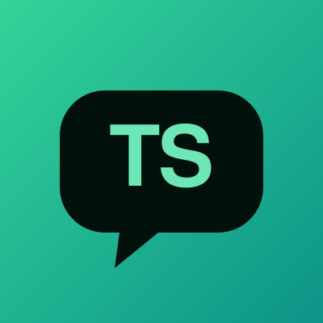
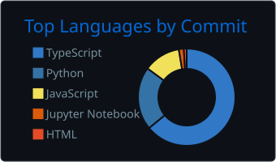
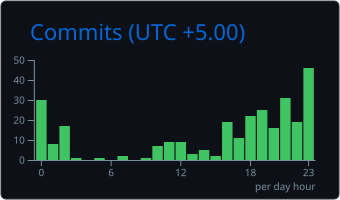

<div align="center">



[](https://botaura.app)

[](https://botaura.app)
[](https://linkedin.com/in/YOUR-LINKEDIN)
[](mailto:YOUR-EMAIL)


</div>

## Who I Am

<table>
  <tr>
    <td width="26%" align="center" valign="middle">
      
    </td>
    <td width="74%" valign="top">

```js
const talha = {
  role:       "Solo founder, full-stack and AI developer",
  location:   "Karachi, Pakistan",
  building:   "Botaura, RAG chatbots for Pakistani SMBs",
  stack:      ["Next.js", "TypeScript", "FastAPI", "Postgres + pgvector"],
  shipped:    "160+ production routes, solo, zero budget",
  lookingFor: "AI / Cloud Systems Engineering roles",
  askMeAbout: ["RAG", "WhatsApp Business API", "Bootstrapping SaaS"],
};
```

</td>
  </tr>
</table>

---

## Featured: Botaura

<div align="center">

[](https://botaura.app)


</div>

> **Bot nahi. Aura.** A multi-tenant RAG chatbot platform for Pakistani SMBs, designed, built and deployed by one person.

| Layer | Stack |
|:--|:--|
| **Frontend** | Next.js 16 App Router, TypeScript, Tailwind v4, Clerk, Drizzle ORM |
| **Backend** | FastAPI, asyncpg, HuggingFace Spaces |
| **Data** | Neon Postgres + pgvector (HNSW), Cloudflare R2 |
| **AI / Search** | Hybrid retrieval (cosine + BM25), multilingual embeddings, LLM fallback chain (Grok + OpenRouter) |
| **Channels** | Web widget, WhatsApp Business API, WooCommerce, Shopify |

**What's inside**

- **Multi-tenant core:** strict tenant isolation, sub-second hybrid retrieval
- **WhatsApp engine:** inbound bot, COD order flow, multi-agent team inbox, customer segmentation
- **Growth tools:** broadcast campaigns via Meta's Marketing Messages API, click-to-WhatsApp ad attribution, abandoned cart recovery
- **Store integrations:** public Store API powering WooCommerce and Shopify

---

## More Builds

| Project | What it does |
|:--|:--|
| **Portfolio + "Ask About Me"** | Next.js 16 portfolio with a live RAG chatbot that answers questions about me |
| **ReelStudio Pro** | Upload a reel, get Whisper captions (Groq), export with burned-in subtitles. Next.js + FastAPI |

---

## Tech Arsenal

<div align="center">


**Levelling up:**


</div>

---

## GitHub Analytics

<div align="center">





</div>

---

## Contribution Snake

<div align="center">
  <picture>
    <source media="(prefers-color-scheme: dark)" srcset="https://raw.githubusercontent.com/Talha-Shaikh1/Talha-Shaikh1/output/snake-dark.svg" />
    
  </picture>
</div>

---

## Right Now

```yaml
building:  Botaura Phase 3.F (WooCommerce plugin + Shopify embedded app)
learning:  DSA, Linux, Docker
open_to:   AI / Cloud Engineering roles, AI + RAG collaborations
```

<div align="center">

*Bot nahi. Aura.*


</div>
